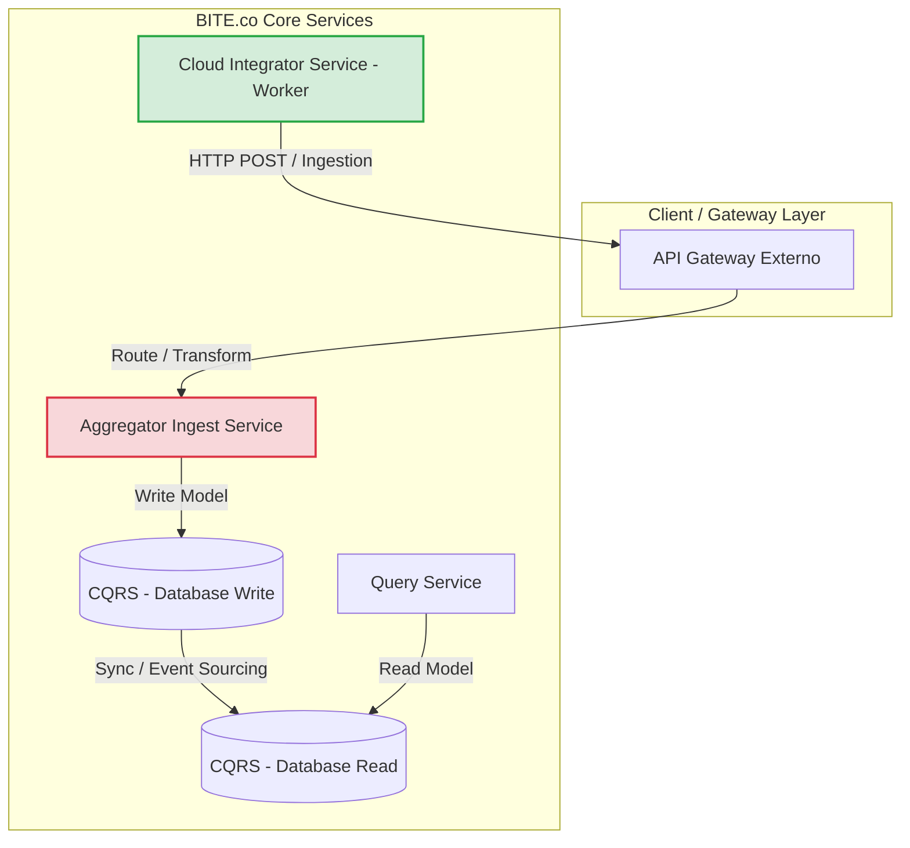
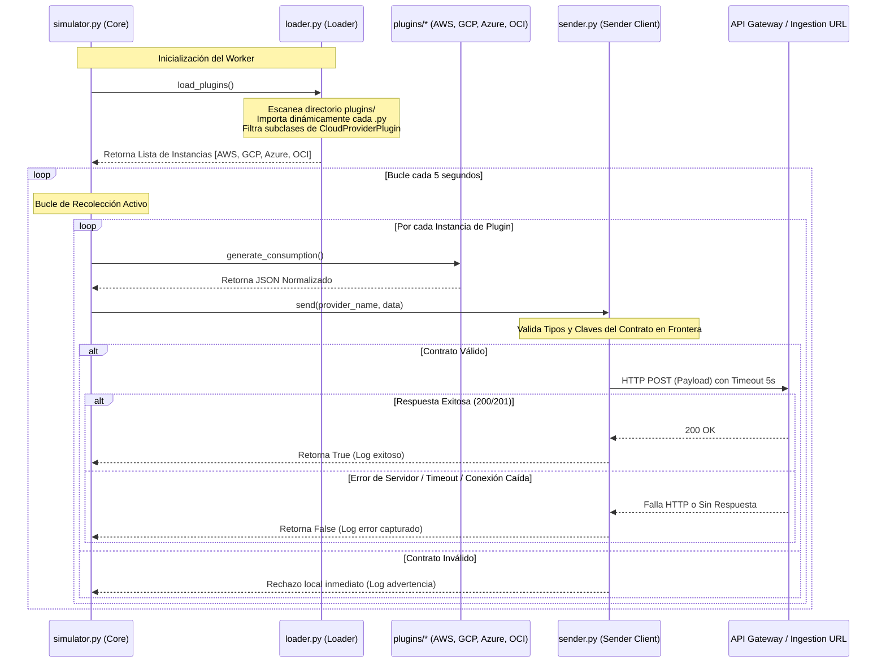

# BITE.co - Cloud Integrator Service
> **Manejador de Integración Cloud para Arquitecturas Cloud Distribuidas**

Este microservicio en Python actúa como el **Manejador de Integración Cloud** dentro de la plataforma corporativa de **BITE.co**. Su responsabilidad principal es operar como un worker continuo resiliente de backend, simular la generación de consumos de múltiples proveedores cloud distribuidos (AWS, GCP, Azure, etc.), normalizar la estructura de datos y enviarlos a través de un canal seguro al agregador de datos central.

---

## 🏛️ Contexto del Sistema e Integración Arquitectónica

El **Cloud Integrator Service** forma parte del ecosistema corporativo de **BITE.co**, el cual sigue un diseño robusto y alineado con los estándares modernos de ingeniería de software distribuidos:



* **Arquitectura de 3 Capas (3-Tier):** El microservicio opera de forma desacoplada en la capa de procesamiento y lógica de negocio distribuida, recolectando y unificando datos en frontera.
* **Worker Continuo (NO API):** No expone endpoints HTTP ni puertos de entrada abiertos, minimizando la superficie de ataque y operando puramente como un agente activo (worker daemon).
* **API Gateway Externo & Ingestor:** Consume el API Gateway corporativo para enrutar los datos hacia el microservicio central de ingesta (`Aggregator Ingest Service`), apoyando los patrones de seguridad, rate limiting y balanceo de carga globales.
* **CQRS (Command Query Responsibility Segregation):** Las cargas despachadas por este integrador representan comandos de escritura de consumos alimentando la base de datos de escritura. Estos datos se sincronizan con las bases de datos de lectura optimizadas para paneles analíticos de costo de BITE.co.

---

## 🧱 Tácticas de Arquitectura e Ingeniería (ASR - Modificabilidad)

El diseño arquitectónico de este componente implementa rigurosamente las tácticas descritas en la literatura de diseño de sistemas distribuidos y atributos de calidad de software (**ATAM / Bass, Kazman & Klein**):

### 1. Táctica: Encapsulate (Encapsulamiento - Bass)
Cada plugin representativo de un proveedor cloud (`AWS`, `GCP`, `Azure`, `OCI`) está aislado dentro de un módulo independiente en la carpeta `plugins/`.
* **Desacoplamiento Total:** Ningún módulo de proveedor conoce la implementación de otro.
* **Aislamiento del Core:** El núcleo del simulador no importa clases de proveedores ni mantiene lógica dependiente de nubes particulares.

### 2. Táctica: Abstract Common Services (Abstracción de Servicios Comunes / SOLID)
El sistema depende estrictamente del contrato estipulado en la interfaz abstracta `CloudProviderPlugin` (en `plugins/base.py`), aplicando el **Principio de Inversión de Dependencia (DIP)**:
* **Contrato Estricto:** Toda implementación de proveedor está obligada a proveer el método `generate_consumption() -> Dict[str, Any]`.
* **Programación orientada a interfaces:** El bucle orquestador del core interactúa con los proveedores exclusivamente mediante esta abstracción base, garantizando la intercambiabilidad del componente (LSP - Liskov Substitution Principle).

### 3. Táctica: Use an Intermediary (Uso de un Intermediario)
El core actúa como el orquestador mediador entre la capa dinámica de plugins y la infraestructura externa de red:
* **Dynamic Plugin Loader (`plugins/loader.py`):** Realiza reflexión en tiempo de ejecución (`pkgutil` + `importlib`) para autodetectar e instanciar los plugins de la carpeta sin necesidad de registrar rutas fijas, clases específicas o configuración de código.
* **Consumption Sender (`simulator/sender.py`):** Encapsula y gestiona la salida de datos de red, abstrayendo a los plugins de protocolos HTTP o reintentos distribuidos.

### 4. Táctica: Defensive Boundary Validation (Validación Defensiva en Frontera)
El componente `ConsumptionSender` implementa validación estricta de esquemas antes de iniciar la transmisión HTTP. Si un plugin devolviera una estructura de datos corrupta o con tipos inconsistentes, el emisor la rechazaría localmente en frontera sin consumir recursos de red ni saturar el Agregador de BITE.co con información inválida.

---

## ☁️ Contrato de Datos Normalizado (Estricto)

Todos los plugins implementados satisfacen de forma rigurosa la normalización en la siguiente firma de salida:

```json
{
  "id_empresa": 1,
  "id_area": 10,
  "id_proyecto": 100,
  "nombre_servicio": "string",
  "costo": 123.45,
  "moneda": "USD",
  "anio": 2026,
  "mes": 5
}
```

---

## 📁 Estructura del Proyecto

```text
integrador-cloud/
│
├── plugins/
│   ├── base.py              # Clase abstracta CloudProviderPlugin (Contrato común SOLID)
│   ├── aws_plugin.py        # Módulo de AWS: EC2, S3, Lambda
│   ├── gcp_plugin.py        # Módulo de GCP: Compute Engine, Cloud Storage, BigQuery
│   ├── azure_plugin.py      # Módulo de Azure: App Service, Azure SQL, Functions
│   ├── oci_plugin.py        # Módulo de OCI (Oracle): Simulación de modificabilidad
│   └── loader.py            # Cargador automático con reflexión e importación dinámica
│
├── simulator/
│   ├── sender.py            # Cliente de red ConsumptionSender (Validación en frontera, timeouts, logging)
│   └── simulator.py         # Orquestador del ciclo de vida y loop continuo (5 segundos)
│
├── .env.example             # Plantilla de variables de entorno para producción
├── .env                     # Variables de entorno activas locales (AGGREGATOR_URL)
├── .gitignore               # Reglas de ignorado corporativas (excluye .env, __pycache__)
├── requirements.txt         # Dependencias optimizadas para el worker
└── README.md                # Esta guía detallada
```

---

## 🚀 Flujo de Datos End-to-End



---

## ⚙️ Guía de Ejecución y Despliegue en Producción

### 🛠️ Requisitos Técnicos
* **Python 3.12**
* No requiere bases de datos locales, contenedores Docker locales ni frameworks web (como Django o Flask), lo que optimiza su uso como daemon worker persistente en infraestructura AWS EC2 o ECS.

### 1. Clonar e Inicializar Rama
```bash
git checkout -b feature/cloud-integrator-service
```

### 2. Instalar Librerías de Producción
```bash
pip install -r requirements.txt
```

### 3. Configurar Entorno
Crea tu archivo `.env` basado en la plantilla:
```bash
cp .env.example .env
```
Asegúrate de configurar la URL del agregador en el archivo `.env`:
```env
AGGREGATOR_URL=http://44.203.209.23:8002/api/ingest/
```

### 4. Lanzar Worker
```bash
python simulator/simulator.py
```

---

## 🔌 Demostración Práctica del ASR de Modificabilidad

La regla crítica de diseño de este sistema exige que:
> **Agregar un nuevo proveedor cloud NO debe requerir modificar ninguna línea de código existente.**

Para incorporar un nuevo proveedor, por ejemplo **Oracle Cloud Infrastructure (OCI)**, no se altera el loader, el emisor ni el simulador principal. Únicamente se realiza una operación puramente **aditiva** colocando el archivo `plugins/oci_plugin.py` en la carpeta `plugins/`:

```python
import random
from typing import Dict, Any
from plugins.base import CloudProviderPlugin

class OCIPlugin(CloudProviderPlugin):
    def __init__(self):
        self.services = ["Compute Instance", "Object Storage", "Autonomous DB"]

    def generate_consumption(self) -> Dict[str, Any]:
        service = random.choice(self.services)
        cost = round(random.uniform(0.50, 300.00), 2)
        
        return {
            "id_empresa": 1,
            "id_area": 10,
            "id_proyecto": 100,
            "nombre_servicio": f"OCI - {service}",
            "costo": cost,
            "moneda": "USD",
            "anio": 2026,
            "mes": 5
        }
```

La próxima vez que el simulador se encienda, el cargador dinámico por reflexión de BITE.co detectará la clase automáticamente, mostrándola en la secuencia de inicialización del worker:

```text
[2026-05-28 23:00:00] [INFO] =====================================================
[2026-05-28 23:00:00] [INFO] Initializing Cloud Integration Simulator...
[2026-05-28 23:00:00] [INFO] =====================================================
[2026-05-28 23:00:00] [INFO] Successfully loaded 4 plugin(s):
[2026-05-28 23:00:00] [INFO]  - AWSPlugin
[2026-05-28 23:00:00] [INFO]  - AzurePlugin
[2026-05-28 23:00:00] [INFO]  - GCPPlugin
[2026-05-28 23:00:00] [INFO]  - OCIPlugin
[2026-05-28 23:00:00] [INFO] Aggregator URL configured: http://44.203.209.23:8002/api/ingest/
[2026-05-28 23:00:00] [INFO] Simulator started. Running loop (Ctrl+C to terminate)...
[2026-05-28 23:00:00] [INFO] -----------------------------------------------------
[2026-05-28 23:00:00] [INFO] Sending AWS consumption...
```

